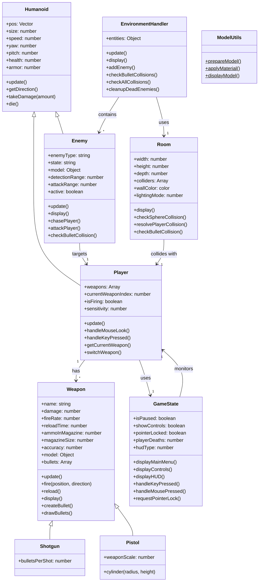

# COMP 350 Final Project

Doom inspired game thingy using p5js

## How to run
1. Clone the repository to your local machine.
2. if you want to run the game locally, you can use a local server like `http-server` or `live-server`.

## UML Class Diagram

## Class Descriptions

### Core Classes
- **Humanoid**: Base class for characters with movement, health, and orientation
- **Player**: User-controlled character with weapons and input handling
- **Enemy**: AI-controlled characters with different behaviors and states

### Weapon System
- **Weapon**: Base class for all weapons with firing, reload, and display logic
- **Shotgun**: Specialized weapon with multiple pellets per shot
- **Pistol**: Basic weapon with custom rendering

### Environment
- **Room**: 3D environment with collision detection and lighting
- **EnvironmentHandler**: Manages entities and collision detection

### Game Management
- **GameState**: Handles game state, UI, and input locking
- **ModelUtils**: Static helper class for 3D model operations
